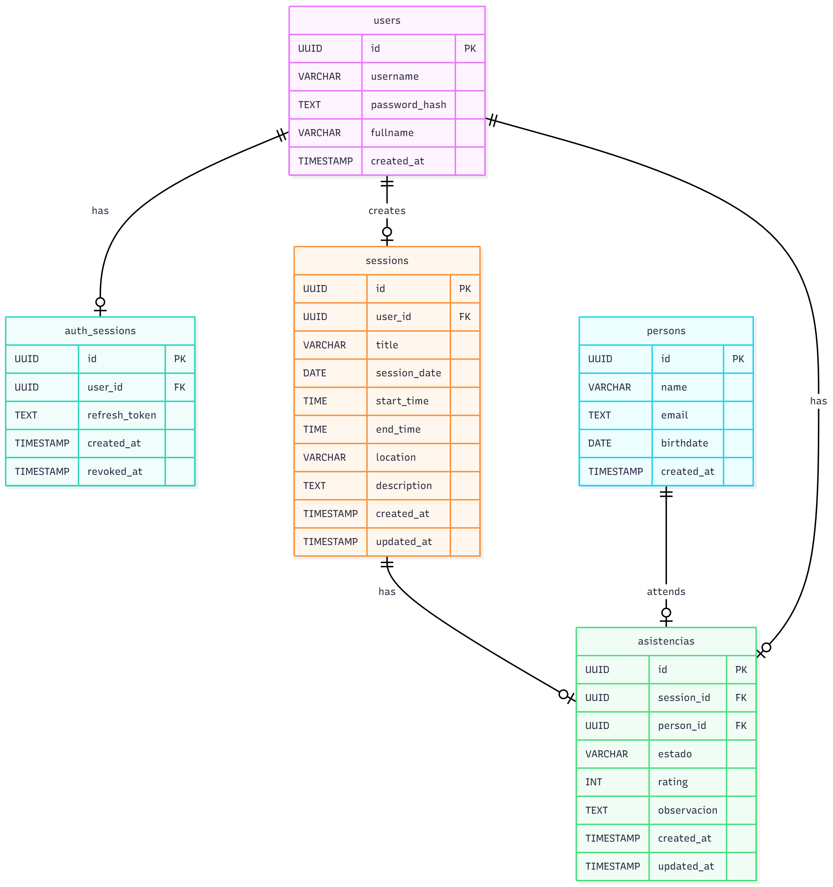

# Mobile Backend

Este es el backend para la aplicación móvil, construido con Node.js y Express. Proporciona funcionalidades básicas como autenticación, gestión de tareas, sesiones y asistencia.



# Link front-end: https://github.com/GuzGuz0208/App_Asistencia 
## Características

- **Autenticación JWT** para seguridad.
- **Conexión con base de datos PostgreSQL**.
- CRUD para tareas, sesiones y registros de asistencia.
- Uso de **Zod** para validaciones de datos.
- **CORS** habilitado para solicitudes desde diferentes orígenes.

## Requisitos

Antes de ejecutar el backend, asegúrate de tener lo siguiente:

- **Node.js** (versión >= 16.x).
- **PostgreSQL** configurado y corriendo.
- Dependencias del proyecto instaladas.

## Instalación

1. Clona este repositorio:
   ```bash
   git clone <https://github.com/Manuel29296/mobile-backend>
   cd mobile-backend


## Instala las dependencias:

npm install

## Crea la base de datos y tablas:

npm run db:create
npm run db:init


## Estructura del proyecto
- src/
  - index.ts                — Punto de entrada (inicia el servidor)
  - app.ts                  — Configuración de Express / middlewares
  - controllers/            — Lógica de controladores por recurso
  - routes/                 — Definición de rutas
  - services/               — Lógica de negocio / acceso a datos
  - models/                 — Esquemas / modelos (ORM / Mongoose)
  - middlewares/            — Autenticación, validación, manejo de errores
  - config/                 — Configuración (env, constantes)
  - utils/                  — Helpers, utilidades
- tests/                    — Tests unitarios / integración
- docs/                     — Documentación adicional / OpenAPI
- .env.example              — Variables de entorno de ejemplo
- package.json
- tsconfig.json
- README.md


## Endpoints principales
Base: /api

- Salud
  - GET /api/health
    - Descripción: Estado del servicio
    - Auth: no

- Autenticación
  - POST /api/auth/register
    - Body: { "email", "password", "name" }
    - Respuesta: 201 { "user", "token" }
    - Auth: no
  - POST /api/auth/login
    - Body: { "email", "password" }
    - Respuesta: 200 { "user", "token" }
    - Auth: no
  - GET /api/auth/profile
    - Descripción: Perfil del usuario autenticado
    - Auth: Bearer 
    
    - Usuarios
  - GET /api/users
    - Descripción: Listar usuarios (paginado)
    - Auth: Bearer (roles según implementación)
  - GET /api/users/:id
    - Descripción: Obtener usuario por id
    - Auth: Bearer
  - PUT /api/users/:id
    - Body: campos actualizables
    - Auth: Bearer (propio usuario o admin)
  - DELETE /api/users/:id
    - Auth: Bearer (admin)

- Recursos (ej. items)
  - GET /api/items
    - Listado público o protegido según caso
  - POST /api/items
    - Crear recurso
    - Auth: Bearer
  - GET /api/items/:id
  - PUT /api/items/:id
    - Auth: Bearer (propietario/admin)
  - DELETE /api/items/:id
    - Auth: Bearer (propietario/admin)

    - Uploads (opcional)
  - POST /api/upload
    - FormData file
    - Auth: Bearer
